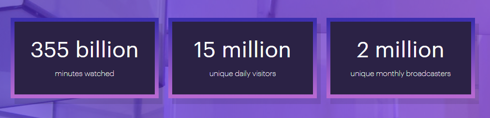

# WORKSHOP Michaël

> Workshop sur Twitch(Amazon) & streaming et initiation à OBS Studio.

-------------------------------------------------------

## 1. Twitch et le streaming en général - qu'est-ce que c'est ?

Twitch c'est avant tout une plate-forme collaborative qui a été créé aux USA (et racheté il y a peu par Amazon) qui permet de regarder des vidéos de gens et plus particulierement des gens qui jouent à des jeux vidéo, d'autres qui font de la cuisine et certains comme nos amis **Mathieu** et **Ludo** qui nous font des sessions au code, il est multiplateforme !

- Le streamer « pédagogue » : Celui qui fait l’éducation des jeux vidéos.
- Le streamer « fun » : Celui qui a pour principe de faire un contenu divertissant et même humoristique.
- Le streamer « didactique » : Celui qui va interagir très souvent avec son audience.
- Le streamer « pro » : Celui qui est un professionnel d’un jeu vidéo.

Le streaming LEGAL est un mode de diffusion et de lecture de contenus (son, vidéo) de séries, de films (coucou Netflix) en _flux_ continu,

(C'est des éléments gérés temporairement et plus généralement la transmission d'informations multimédia c'est donc l'import du media via le streaming.)

très utilisé sur Internet depuis pas mal d'années maintenant il y a eu toute sorte d'évolution au fil du temps.

--------------------------------

## 2. Twitch vs Youtube vs Youtube Gaming

Sur YouTube, les vidéos sont éditées et montées en amont, puis stockées sur la plate-forme de Google, alors que sur Twitch, il s'agit de retransmissions en direct, dans les mêmes conditions que la finale de la Coupe du monde ou que l'Eurovision.

Google a tenté de suivre la marche et a créé _Youtube Gaming_ moins populaire oui je sais difficile a croire mais c'est le cas et c'est pourquoi j'ai décidé de vous parler du streaming, de twitch, de youtube parce que c'est pour moi l'avenir de la sphère vidéoludique.

Maintenant la question que tout le monde se pose j'en suis sur c'est l'interet réel de regarder des gens jouer c'est la critique habituellement adressée de l'extérieur à Twitch, et pourtant, pour un amateur de jeux vidéo, les avantages ne manquent pas.

Tout d'abord :

- Le plaisir du direct, si on peut vibrer pour du football (a part pour la France) on peut vibrer pour une competition de son équipe favorite de son jeu favori avec son lot d'adrénaline et de suspense.

- Les compétitions internationale de jeu vidéo (E-sport). 

- Les speedrun ce sont des tentatives rapide pour battre un record du monde sur un jeu 

- Ca permet de voir en action des jeux que l'on hésiterait à acheter, et parfois d'en découvrir certains auxquels on n'aurait même pas imaginé donner une chance.

Bref ou je veux en venir c'est que ca va changer considérablement notre façon de se tenir informer, de nous divertir surtout et ca le fait déjà a savoir que Twitch.tv représente 43,6% du volume de contenu streaming en 2014 (aux dernieres nouvelles ce chiffre serait passé a du 78%) pas mal pour un média qu'on annoncait défaillant.. ca dépasse même la WWE (chaine qui diffuse du catch) ou encore l’ESPN (plateforme basée sur le sport) les créateurs de contenu appelé "streamers" ont bien capté le message...

## On entre dans le monde du numérique qu'on le veuille ou non avec un média récent et élitiste, il va falloir s'y habituer !!!

--------------------------------

## 3. Twitch fusion (extension overwolf) et sa propre API...

https://www.youtube.com/watch?v=WOi75bb_SoQ

A sa voir que Twitch a sa propre API ~ Twitch developers.

https://dev.twitch.tv/docs/

Cette première version fournira aux créateurs de Twitch des outils qui permettront la création de nouvelles experiences pour l'utilisateur dans un premier temps (viewer) et pour la chaine qui diffuse son "programme" (streamer).

https://github.com/twitchdev/developer-rig

- Chatbots
- Extensions
- Rewards (système de récompense)

--------------------------------------------------

## 4. Petite mise en pratique d'OBS Studio (si affinités)

OBS : Open Broadcaster Software

C'est le logiciel libre le plus utilisé et totalement open source (qui permet la capture d'écran et de streaming exploité sur Microsoft, MacOS & Linux) à savoir qu'un programme a vu le jour en Beta (Windows du moins pour le moment) Streamlabs va permettre de pousser encore plus loin la configuration du streaming a en faire pâlir OBS ..

bref attaquons tout de même OBS qui a le mérite d'etre multiplatforme 

* Télécharger OBS Studio : https://obsproject.com/fr/download#closeNotice.
* Prendre le fichier ZIP l'extraire sur votre bureau ou autres.
* Scene "Start Stream" : ajouter le start stream mp4 + timer mp4 en chromatique.
* Scene "Online" : ajouter l'overlay + la cam.
* Scene "Talkshow" : ajouter le talkshow + cam (no minichat).
* Scene "End Stream" : ajouter pour finir le end stream.

Pour ceux et/ou celles qui veulent en savoir + sur Twitch les réglages du lancement d'un stream online qu'on me le fasse savoir !

# Un grand merci a vous et qui sait @bientot sur Twitch !!!

